# 10-Bit-Potentiometric-DAC

This project presents the design of a 10 Bit Potentiometric Digital to Analog Converter using end-to-end Open-source EDA tools. The aim is to design a 10-bit potentiometric Digital to Analog Converter(DAC) with 3.3V analog voltage, 1.8V digital voltage  using the sky130nm technology node.

# Table of contents

  * [1. Introduction](#introduction)
  * [2. Opensource Tools used](#opensource-tools-used)
  * [3. Pre Layout Simulations](#pre-layout-simulations)
     + [Switch](#switch)
     + [2 Bit DAC](#2-bit-dac)
     + [3 Bit DAC](#3-bit-dac)
     + [4 Bit DAC](#4-bit-dac)
     + [5 Bit DAC](#5-bit-dac)
     

# Introduction

In real world, most of the signals are analog in nature while the digital systems can understand only digital signals. Hence it becomes essential to convert real world analog signals into digital signals. This can be done using digital to analog converters(DACs). A digital to analog converter takes in digital bits as input and converts it into correponding analog voltage.

An n-bit Digital to Analog Converter (DAC) takes in n-bit digital input and converts it into corresponding analog voltage level with respect to the reference voltage. The potentiometric DAC used in the design uses the concept of Voltage Divider.It consists of 2^N equal resistors connencted in series. The basic architecture of an N-bit potentiometric DAC is shown in the figure below.

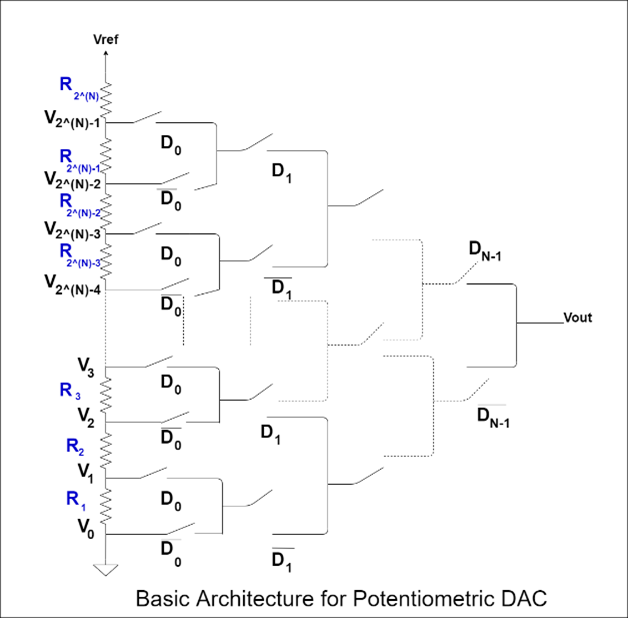

The switches in the above circuit are designed as shown below.

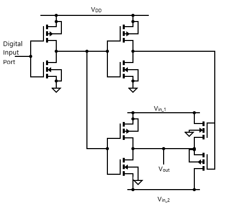

# Opensource Tools used

1. eSim: eSim is a Free and Open source EDA tool for circuit design, simulation, analysis and PCB design developed by FOSSEE, IIT Bombay. It is an integrated tool built using free/libre and open source softwares such as KiCad, Ngspice and GHDL. It serves as an alternative to commercially available/ licensed software like OrCAD, Xpedition and HSPICE. For more info refer: https://esim.fossee.in/home

2. Ngspice: Ngspice is the open source spice simulator for electric and electronic circuits. Ngspice offers a wealth of device models for active, passive, analog, and digital elements. Model parameters are provided by the semiconductor device manufacturers or from semiconductor foundries. The user simply adds his/her circuits as a netlist, and the output is one or more graphs of currents, voltages and other electrical quantities or is saved in a data file. For more info refer: http://ngspice.sourceforge.net/

3. Skywater Pdk: The SkyWater Open Source PDK is a collaboration between Google and SkyWater Technology Foundry to provide a fully open source Process Design Kit and related resources, which can be used to create manufacturable designs at SkyWater’s facility. As of May 2020, this repository is targeting the SKY130 process node. For more info refer: https://github.com/google/skywater-pdk, https://skywater-pdk.rtfd.io

# Pre Layout Simulations
   
  # Switch 
  
 The schematic of the switch circuit designed in eSim is shown below :
   
 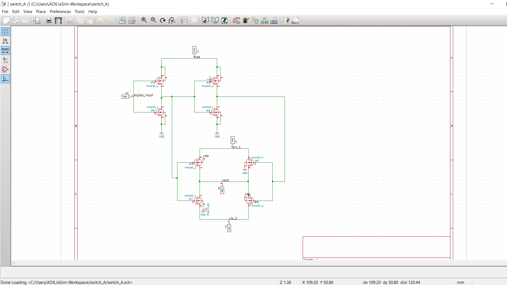

The result of transient analysis of the switch circuit is shown below:

 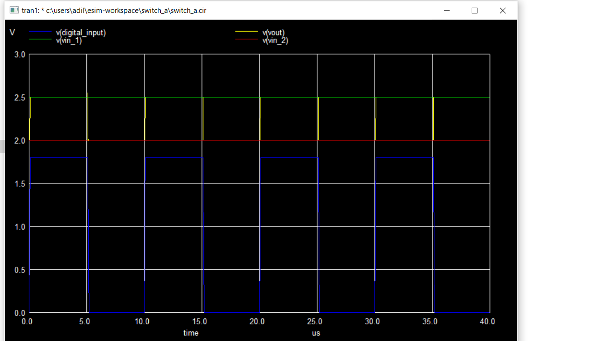

# 2 Bit DAC

For designing the 2 bit DAC, switch circuit was used as a subcircuit.\
The schematic of the 2 bit DAC circuit  is shown below :

 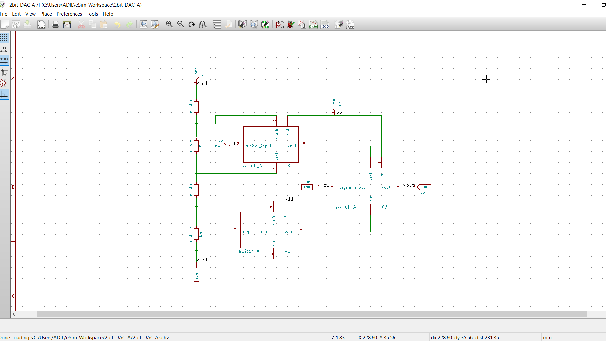
 
 The result of the transient analysis of the 2bit DAC is shown below:
 
 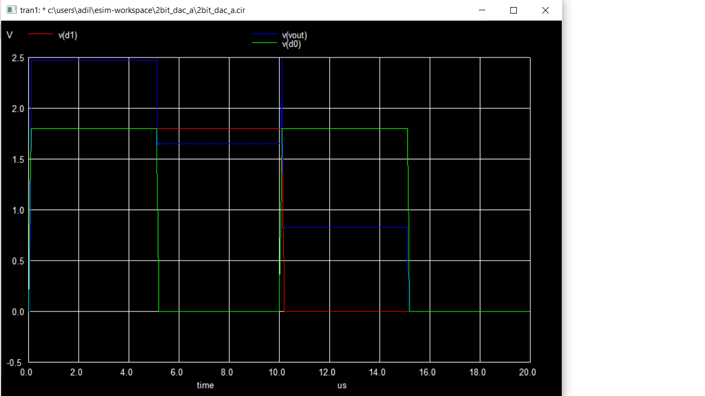
 
# 3 Bit DAC

For designing the 3 Bit DAC, 2 Bit DAC as well as the switch circuit were used as a subcircuit.\
The schematic of the 3 bit DAC circuit in eSim is shown below :

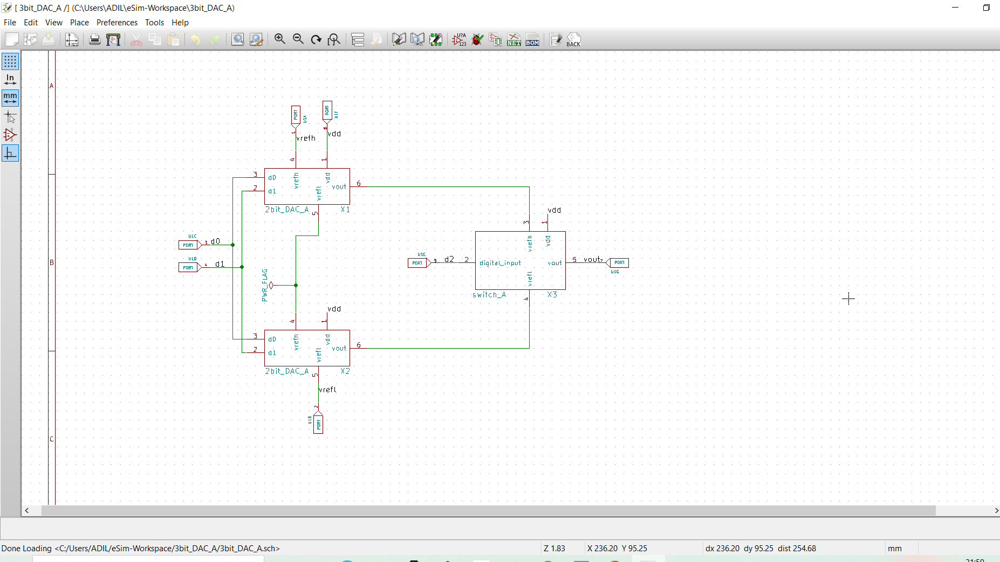

 The result of the transient analysis of the 3bit DAC is shown below:
 
 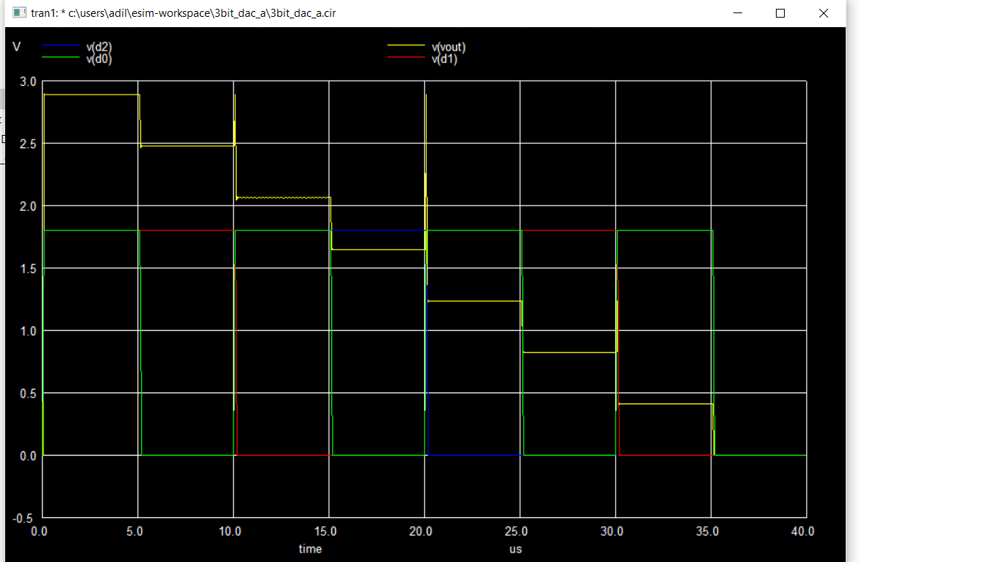
 
# 4 Bit DAC

For designing the 4 Bit DAC, 3 Bit DAC as well as the switch circuit were used as a subcircuit.\
The schematic of the 4 bit DAC circuit in eSim is shown below :

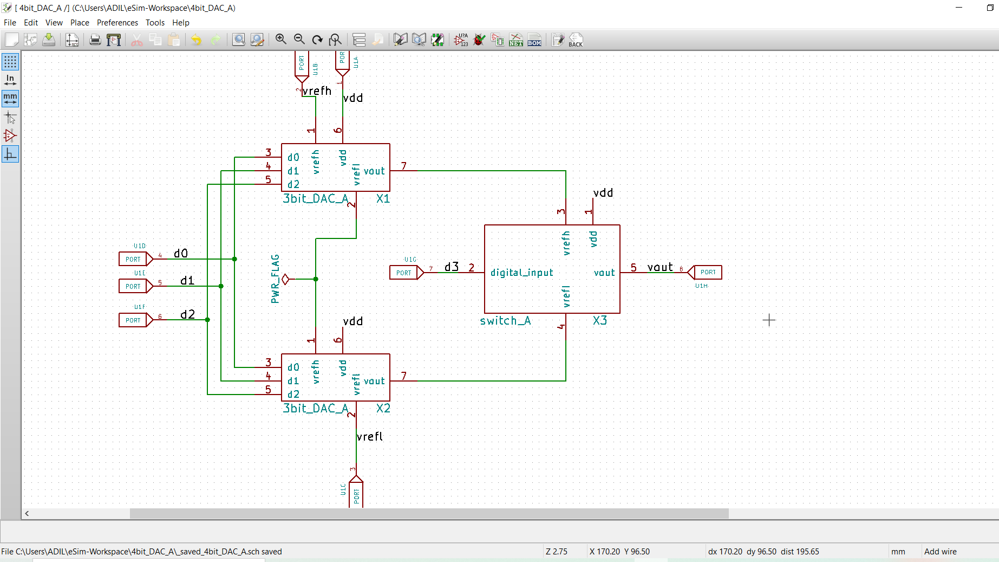

 The result of the transient analysis of the 4 bit DAC is shown below:
 
 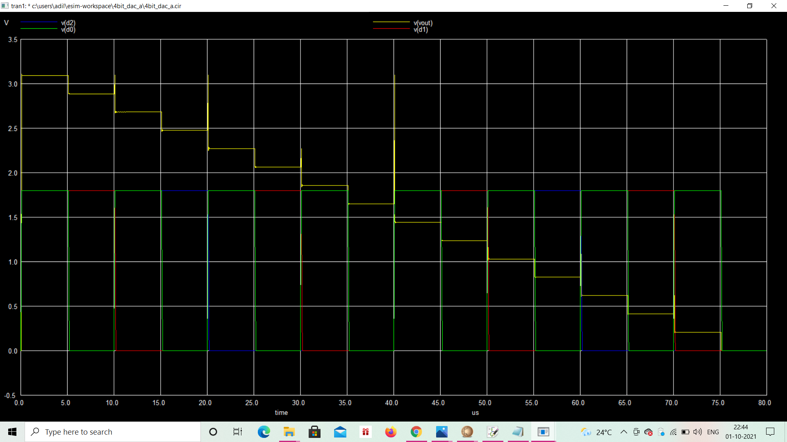
 
 # 5 Bit DAC
 
 For designing the 5 Bit DAC, 4 Bit DAC as well as the switch circuit were used as a subcircuit.\
The schematic of the 5 bit DAC circuit in eSim is shown below :

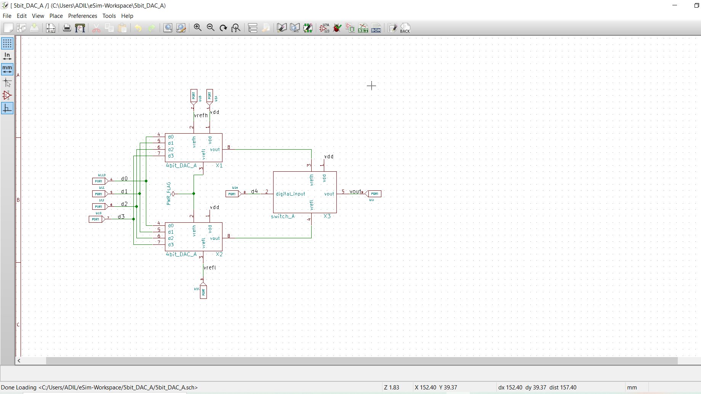

 The result of the transient analysis of the 5 bit DAC is shown below:
 
 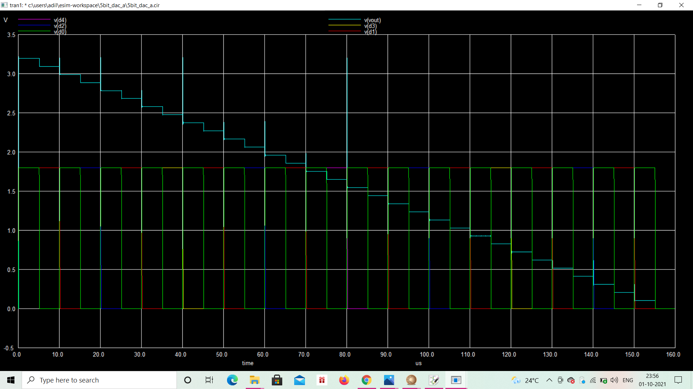
 
# Further Work
   * To obtain simulation output for 10 Bit DAC
# References

  * [1. https://github.com/vsdip/avsddac_3v3_sky130_v2](https://github.com/vsdip/avsddac_3v3_sky130_v2)
 
# Contributor

  * Abu Mahamed Adil, B.Tech(Electronics & Communication Engineering), Assam Don Bosco University, 
    - [abumdadil@gmail.com](abumdadil@gmail.com)
